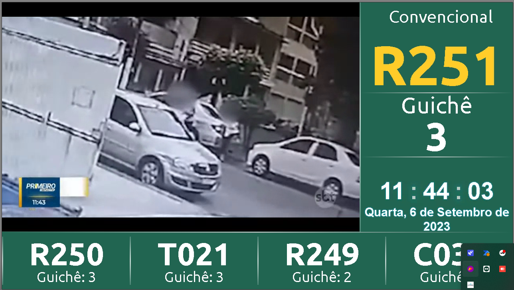

# Painel TV
## Compatível com NovoSGA 1.5.0
Essa é uma versão com algumas adaptações que fiz para atender a minha necessidade

Ajustes realizados por mim:
- Senhas comuns piscam o fundo em verde
- Senhas prioritárias piscam o fundo em vermelho
- Pequenos ajustes no layout

Atualmente exibe o canal SBT através de um link disponibilizado pela emissora no Youtube, mas suporta M3U.

###  Para alterar o vídeo do Youtube:

Navegue até: 
```sh
\themes\default\index.php
```
no seguinte trecho

```php
case 'youtube':
?>
<iframe width="896" height="575" src="INSIRA O LINK DO YOUTUBE AQUI" title="YouTube video player" frameborder="0" allow="accelerometer; autoplay; clipboard-write; encrypted-media; gyroscope; picture-in-picture" allowfullscreen></iframe>
<?php
```

> Alterar `width="" height=""` para se adequar ao seu monitor

### Para alterar para M3U:

O computador que irá exibir o painel precisa utilizar o navegador Google Chrome, ou Chromium, e possuir a seguinte extensão:

[Play HLS](https://chrome.google.com/webstore/detail/play-hls/hahkjjkedonglpienpfiganogikkkoii)

Após instalar a extensão indicada, navegue até:

Navegue até 
```sh
\themes\default\
```
> no arquivo config.json altere `"tipo": "youtube"` para `"tipo": "m3u"`


No arquivo index.php 

```php
case 'm3u':
?>
<iframe id="slides-container" src="chrome-extension://hahkjjkedonglpienpfiganogikkkoii/player.html#<?php echo $dadoDoVideo; ?>" frameborder="0"></iframe>
<?php
```

> no trecho `/player.html#<`

Entre o # e o < insira o link m3u, ex.: 

```php
case 'm3u':
?>
<iframe id="slides-container" src="chrome-extension://hahkjjkedonglpienpfiganogikkkoii/player.html#SEULINKAQUI.m3u8<?php echo $dadoDoVideo; ?>" frameborder="0"></iframe>
<?php
```

Sugestão de lista de canais M3U gratuitas e públicas:
[IPTV Org](https://github.com/iptv-org/iptv)

## Licença

MIT

**Esse código não foi 100% escrito por mim, fiz apenas algumas adaptações, alguns trechos foram escritos por outros colegas e compartilhados na comunidade do [NovoSGA](https://github.com/novosga/novosga), eu apenas os compilei e fiz a minha versão**


## Screenshots

